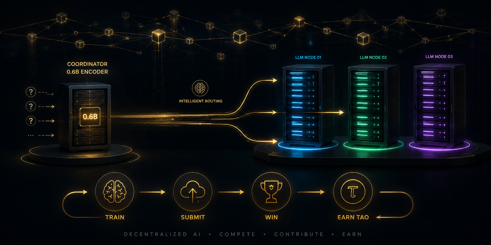

<div align="center">
  
  
  # 🐡 TinyRouter
  
  ### The incentivized open benchmark for LLM routing intelligence.
  
  Train a **13,312-parameter** routing head. Beat the king across **3 benchmarks**. Earn **TAO**.

  [](https://github.com/entrius/gittensor)
  [](https://github.com/James-CUDA/Gittensor-TinyRouter/actions)
  [](LICENSE)
  
  [Milestone 1](docs/MILESTONE1.md) · [Submit (live)](SUBMITTING.md) · [Rules](docs/COMPETITION_RULES.md) · [Scoring](docs/EVALUATION_PIPELINE.md) · [Leaderboard](leaderboard.json)
</div>

---

## Three milestones

Start offline, then compete live:

| Milestone | Goal | API? | Dataset / docs |
| --- | --- | --- | --- |
| **1 — Prompt triage** | Predict **domain** + **difficulty** | No | [`tinyrouter-m1`](https://huggingface.co/datasets/James-Cuda/tinyrouter-m1) · [`docs/MILESTONE1.md`](docs/MILESTONE1.md) |
| **2 — Model routing** | Pick a model from cached router corpora | No | `James-Cuda/router-bench` milestone2 |
| **3 — Live TinyRouter** | Route **3 models × 3 roles**; beat the king → **TAO** | Yes | [`SUBMITTING.md`](SUBMITTING.md) |

**Milestone 1 (current offline track):** miners submit **head + weights only** (under 1M params, 1/day). Host encoder is frozen Qwen3-0.6B. Validator scores king vs challenger on a fixed test set; merge if challenger ≥ king + **0.02**.

```bash
# Pack → preflight → (host) validate
python scripts/pack_milestone1.py --miner-name alice --config 5-domain --weights head.npz
python scripts/preflight_milestone1.py --submission submissions/alice/m1 --miner-name alice
python scripts/validate_milestone1.py \
  --challenger submissions/alice/m1 --miner-name alice --config 5-domain --promote
```

Default head: `TriageHead` (± attentive pool). See [`docs/MILESTONE1.md`](docs/MILESTONE1.md).

---

## The challenge (Milestone 3 — live)

Three models. Three benchmarks. One tiny head.

```
  Your query
      │
      ▼
  Qwen3-0.6B encoder (frozen)
      │
      ▼
  13K-param routing head
      │
      ├──▶ which model?  ──▶  qwen3.5-35b-a3b  |  gemini-3.1-flash-lite  |  deepseek-v4-flash
      │
      └──▶ which role?   ──▶  Thinker  |  Worker  |  Verifier
```

The head never solves the task. It only learns **who to ask**. Train it via separable CMA-ES against a binary correct/wrong reward. The best head wins.

## Quick start

```bash
# 1. Clone & install
git clone https://github.com/James-CUDA/Gittensor-TinyRouter.git
cd Gittensor-TinyRouter
pip install -e ".[dev]"
export OPENROUTER_API_KEY=sk-or-v1-...

# 2. Train one head across all three benchmarks
CUDA_VISIBLE_DEVICES=0 python -m trinity.train \
    --benchmarks math500,mmlu,livecodebench \
    --run-name my-head

# 3. Pack
python scripts/pack_submission.py \
    --run-dir experiments/composite/my-head \
    --miner-name your-name --benchmark composite

# 4. Submit — open a PR with submissions/your-name/1/
# 5. The bot auto-checks your gates (~30s). If passed, earn TAO 🏆
```

> **Full walkthrough:** [`docs/REPRODUCTION_GUIDE.md`](docs/REPRODUCTION_GUIDE.md)

## Competition

| | |
|---|---|
| **Benchmarks** | `math500` (math) · `mmlu` (knowledge) · `livecodebench` (code) |
| **Model pool** | `qwen3.5-35b-a3b` · `gemini-3.1-flash-lite` · `deepseek-v4-flash` |
| **Same pool** | All miners route to the same three models. Routing skill is what matters. |
| **One head** | A single head routes across all three benchmarks. No per-benchmark heads. |
| **Win margin** | Composite must beat the current king by **≥ 0.02** (2 percentage points). |
| **Rate limit** | 1 submission per day. |
| **Scoring** | 70% cached accuracy · 15% live multi-turn · 10% efficiency · 5% novelty |

<details>
<summary><b>How scoring works</b></summary>

Each benchmark is scored independently, then averaged into a composite:

```
bench_score = (0.70 × cached_acc + 0.15 × live_acc
              + 0.10 × efficiency + 0.05 × novelty) × overfit_penalty

composite = mean(bench_score_math500, bench_score_mmlu, bench_score_livecodebench)
```

- **Cached accuracy (70%):** 150 hidden questions with pre-stored model answers. Zero API cost, fully deterministic.
- **Live accuracy (15%):** 20 questions through the full Thinker→Worker→Verifier loop with real API calls.
- **Efficiency (10%):** Fewer turns per correct answer = higher score.
- **Novelty (5%):** Making different routing decisions from the current king.
- **Overfit gate:** Eval−audit accuracy gap > 15% = hard reject. > 8% = 0.85× penalty.

Full details: [`docs/EVALUATION_PIPELINE.md`](docs/EVALUATION_PIPELINE.md)
</details>

<details>
<summary><b>Pre-eval gates (auto-checked by bot)</b></summary>

When you open a PR, the submission bot automatically runs 4 offline gates within ~30 seconds. If any fails, the PR is auto-closed with the reason.

| # | Gate | What it checks |
|---|---|---|
| 1 | Rate limit | ≤ 1 submission per day per miner |
| 2 | Weight sanity | Correct shape `(6, 1024)` + `(7168,)`, no NaN/Inf, not all-zeros |
| 3 | Duplicate detection | Cosine similarity < 0.99 vs all prior submissions + current king |
| 4 | Receipt | Cost > $0 and > 2 fitness entries (≥ 3 training generations) |

Gate 5 (overfit check) runs during the full evaluation by the maintainer.
</details>

## Baselines — what you're beating

```bash
# Single-model floor (best of these = "best-single", the simplest strategy to beat)
python baselines/always_model.py --model qwen3.5-35b-a3b --benchmark math500
python baselines/always_model.py --model gemini-3.1-flash-lite --benchmark math500
python baselines/always_model.py --model deepseek-v4-flash --benchmark math500

# Random routing floor (your head MUST beat this)
python baselines/random_router.py --benchmark math500 --seeds 100

# Perfect-router ceiling (how much routing headroom exists)
python scripts/oracle_ceiling.py --collect --benchmark math500
python scripts/oracle_ceiling.py --analyze experiments/final/oracle_matrix_math500.json
```

## Documentation

| 📖 | Document | For |
|---|---|---|
| 1️⃣ | [`MILESTONE1.md`](docs/MILESTONE1.md) | Offline triage: pack, gates, king vs challenger |
| 📋 | [`COMPETITION_RULES.md`](docs/COMPETITION_RULES.md) | What you can/can't do, frozen files, cheating criteria |
| ⚙️ | [`EVALUATION_PIPELINE.md`](docs/EVALUATION_PIPELINE.md) | How every live score is calculated |
| 🏗️ | [`ARCHITECTURE.md`](docs/ARCHITECTURE.md) | Repo structure, design principles, subsystem map |
| 🚀 | [`REPRODUCTION_GUIDE.md`](docs/REPRODUCTION_GUIDE.md) | Clone-to-submit walkthrough (live track) |
| 📝 | [`SUBMITTING.md`](SUBMITTING.md) | Live routing-head PR workflow + M1 pointer |
| 📖 | [`docs/GLOSSARY.md`](docs/GLOSSARY.md) | Term definitions |

## Repository

```
src/trinity/
├── coordinator/          Encoder + LinearHead (live) + TriageHead / AttentivePool (M1)
├── m1/                   Milestone-1 pack, gates, metrics, leaderboard, scoring
├── adapters/             Benchmark adapters
├── submission/           Live competition gates + leaderboard + anti-cheat
├── orchestration/        Multi-turn session loop + shared grader
├── optim/                Separable CMA-ES trainer + fitness evaluation
├── llm/                  OpenRouter client + hash-chain cost ledger
├── analysis/             Oracle ceiling + convergence + selective prediction
└── fugu/                 Conductor orchestration (Tier 2 — future)

baselines/                Reference baselines (always-model, random-router)
scripts/                  M1 pack/eval/validate · pr_eval · pack_submission · …
scripts/legacy/           One-shot Hub builders for router-bench history
configs/                  trinity.yaml (training) + models.yaml (pool)
tests/                    Offline tests (incl. M1 gates / triage heads)
docs/                     Competition + MILESTONE1 + architecture docs
```

## Research

Built on [TRINITY](https://arxiv.org/abs/2512.04695) (Xu et al., ICLR 2026) —
a compact coordinator that delegates to a pool of LLMs via an evolved routing
head, without touching the models' weights.

- 📊 Honest results: [`docs/RESULTS.md`](docs/RESULTS.md)
- 🔬 Lab notebook: [`docs/JOURNAL.md`](docs/JOURNAL.md)
- 📐 Implementation spec: [`docs/SPEC.md`](docs/SPEC.md)

## License

MIT
